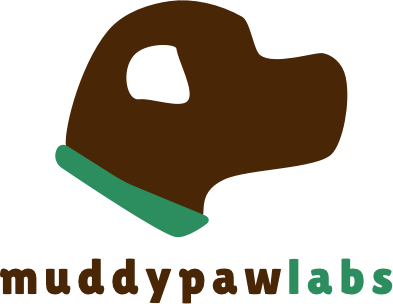

## Humans are born builders and that's what we strive to do here.

Since the beginning of time, humans have been thinking, designing, and building- the Gardens of Babylon, the abacus, and the printing press are a few monumental achievements that come to mind. This has continued well into the second millenia and cannot stop if we expect to advance humanity. Thinkers of our day such as Bezos, Musk, and Zuckerberg have built vast empires but continue to be motivated daily by creating and building "things" to achieve their respective missions.

Growing up, we're not nervous nor do we hesitate to jump right into something and get our hands dirty. We don't stop and think about the risks or consequences nor do we question our own limits. The most successful products are built by those who aren't afraid to jump right in and iteratively derisk the product by running experiments centered around the user's needs and goals.

My name is [Santosh Sankar](http://www.santoshsankar.com) and this is where I work on my personal projects and get "my hands dirty" experimenting and building new things. I'm the Founding Director of the [Dynamo Accelerator & Fund](http://www.hellodynamo.com) where I spend my time working with founders trying to change the face of logistics, transportation, and supply chain.

## What We're Working On

**Matterhorn.** An exclusive community of founders who support one another by sharing their insights, network, and more as they scale their respective mountains. *Coming soon*

## We write and share our thoughts across the internet -- here's where we're the most active.

* [@muddypawlabs](http://www.twitter.com/muddypawlabs)
* [@santoshsankar](http://www.twitter.com/santoshsankar)
* [Blog](http://www.santoshsankar.com)
* [Hit. The. Button.](http://www.hitthebutton.com)

## Colophon

### Lilita One
Juan Montoreano designed [Lilita One](https://fonts.google.com/specimen/Lilita+One) typeface with a fat look, ideal for headlines and short texts. With a slightly condensed structure and some eye-catching details, it adds personal and soft looks to any page. *Source: Google Fonts.*

### Lato.
Łukasz Dziedzic designed [Lato](https://fonts.google.com/specimen/Lato) which means "summer" in Polish in 2010. He wanted to create a typeface that would seem quite “transparent” when used in body text but would display some original traits when used in larger sizes. He used classical proportions (particularly visible in the uppercase) to give the letterforms familiar harmony and elegance. At the same time, he created a sleek sans serif look. *Source: Google Fonts.*

The site is based on the [Solo](https://github.com/chibicode/solo/) theme by Shu Uesugi ([Twitter](http://twitter.com/chibicode))

## Legal

Copyright &copy; 2016 muddypawlabs. All Rights Reserved.

